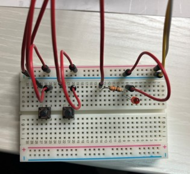
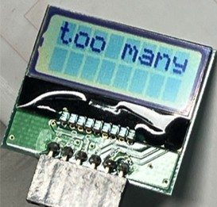
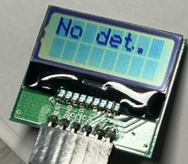
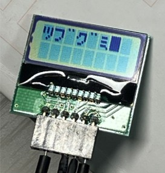

# Object-Detection-on-Raspberry-Pi

## 解説

Raspberry Pi 4Bを使用して、お気に入りのグミ（ツブグミ、カムカムレモン）を検出し、LCDモニターに検出したグミの名前を表示した。

## 結果

左側のスイッチで初期化をし、右側のスイッチで画像を撮る。Loadingの最中はLEDが点灯するようにした。

  

検出結果は以下の通りで、

  
  

  
  

