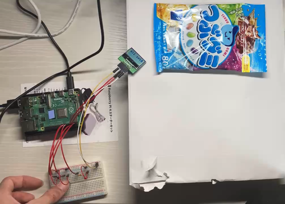
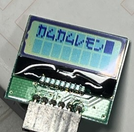

# Object-Detection-on-Raspberry-Pi

このプロジェクトは、**Raspberry Pi 4B** を使用し、**ツブグミ**と**カムカムレモン**を検出してLCDモニターに表示する物体検出のプロジェクトです。

## 準備
- Raspberry Pi 4B に PyTorch をインストールする。
- `.env`ファイルを作成し、このプロジェクトを格納しているパスを以下のように記述する。
  ```bash
  URL='/home/pi/your_project_path'

## ファイル構成
このプロジェクトの主要なディレクトリとファイルの構成について説明します。

- `docs/images` : 実行結果などの画像を格納
- `data/` : モデルのテストで使用する画像を格納
- `models/` : 学習済みモデル（SSDモデル）
- `LCD.py` : LCDの制御用スクリプト
- `run.py` : メイン実行スクリプト
- `test.py` : モデルの動作確認用スクリプト

## 実装の概要

- 左のスイッチでシステムを初期化
- 右のスイッチで画像を撮影
- 処理中はLEDが点灯

<p align="center">
  
</p>

<p align="center">
  
</p>

## 検出結果の例

検出結果は以下の通りです。

- 左上：二つ以上検出した場合

- 右上：何も検出しなかった場合

- 左下：ツブグミを検出した場合

- 右下：カムカムレモンを検出した場合

<p align="center">
  
  
</p>
<p align="center">
  
  
</p>

## 参考
このプロジェクトは以下の本を参考に進めました。
- 「物体検出とGAN、オートエンコーダー、画像処理入門 PyTorch/TensorFlow2による発展的・実装ディープラーニング」
- 「ラズパイ5対応 Raspberry Piで学ぶ電子工作」
